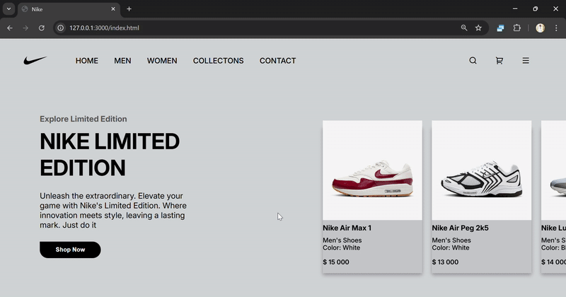

# Nike Limited Edition - E-Commerce Showcase



## 🚀 Project Overview

A modern Nike product showcase built with cutting-edge frontend technologies. This e-commerce interface demonstrates:

- **Professional UI/UX design** with Nike's brand aesthetic
- **Responsive layout** using advanced CSS techniques
- **Interactive product display** with horizontal scrolling
- **Optimized performance** with clean, efficient code

## ✨ Technical Highlights

### 🧩 Advanced Layout Techniques

- **Flexbox Mastery**:

  - Perfectly aligned navigation bar with `justify-content: space-between`
  - Content division using flexible boxes for responsive design
  - Centered elements with `align-items: center`

- **CSS Positioning**:

  - Absolute positioning for product details overlay
  - Relative/absolute combinations for precise element placement

- **Scrollable Product Gallery**:

  - Custom horizontal scroll implementation
  - Hidden scrollbars with `::-webkit-scrollbar`
  - `white-space: nowrap` for inline product display

### 🎨 UI/UX Features

- **Typography Hierarchy**:

  - Google's Inter font with varied weights
  - Strategic text transformations (uppercase/capitalize)

- **Visual Design**:

  - Nike brand-aligned color scheme
  - Product cards with subtle shadows
  - Consistent spacing and padding

- **Interactive Elements**:

  - Hover-ready navigation items
  - Custom-styled buttons with unique border-radius
  - Shopping cart/search icons

## 🛠️ Tech Stack

- **HTML5** semantic structure
- **CSS3** (Flexbox, Positioning, Scroll Behavior)
- **Remix Icons** for scalable vector icons
- **Google Fonts** (Inter) for typography
- **Mobile-first** responsive principles

## 💡 Why This Stands Out

This project demonstrates:

1. **Production-ready code quality** with:

   - Clean, maintainable CSS
   - Properly structured HTML
   - Performance-conscious decisions

2. **E-commerce best practices**:

   - Effective product presentation
   - Clear pricing information
   - Visual hierarchy

3. **Attention to detail**:

   - Pixel-perfect spacing
   - Consistent styling
   - Brand-appropriate design

## 🔧 Installation

```bash
git clone https://github.com/ogidy/nike_website_1.git
cd nike_website_1
```